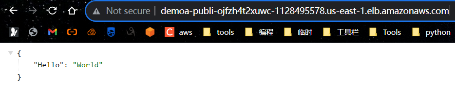
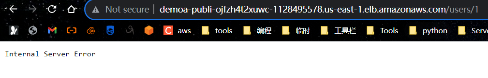

#### copilot 部署 ECS FastApi应用

#### 文件夹结构
```bash
.
├── Dockerfile
├── app
│   ├── __init__.py
│   └── main.py
└── requirements.txt
```
```bash
copilot init -a demoapp -t "Load Balanced Web Service" -n "fastmysql" -d ./Dockerfile     
# copilot init -a 应用名 -t "固定类型" -n "Service名字" -d ./Dockerfile

copilot env init --name uat --profile default --import-vpc-id vpc-055dec0736877f582 --import-public-subnets subnet-06f008ada1c41f1a0,subnet-0d7d662a9cb875c44,subnet-0535b256ed654c75a,subnet-018bfac11befe86ad,subnet-03d141d4ea5df2935,subnet-0768d1b7295c8780d 
# copilot env init --name 环境 --profile default --import-vpc-id vpc-id --import-public-subnets subnet-id1,id2 

copilot env deploy --name "uat"
# copilot env deploy --name "环境"

copilot deploy --name "fastmysql" -e "uat"
# copilot deploy --name "Service名字" -e "环境"
```
#### 运行之后
```bash
.
├── Dockerfile
├── app
│   ├── __init__.py
│   └── main.py
├── copilot
│   ├── environments
│   │   └── uat
│   │       └── manifest.yml
│   └── fastmysql
│       └── manifest.yml
└── requirements.txt
```




上面是未创建RDS的


下午任务
- 创建RDS
- 修改代码，重新部署应用
- 设置传入参数

```bash
理论知识
copilot svc deploy --env-vars VAR1=value1 VAR2=value2 VAR3=value3

```

├── Dockerfile
├── app
│   ├── __init__.py
│   └── main.py
├── copilot
│   ├── environments
│   │   └── uat
│   │       └── manifest.yml
│   └── fastmysql
│       └── manifest.yml
└── requirements.txt

这个里面只修改了main.py
```python 
import os

db = mysql.connector.connect(
    host=os.environ.get('host'),
    user=os.environ.get('user'),
    password=os.environ.get('password'),
    database=os.environ.get('database')
)
```
```sql
-- 创建RDS数据
-- 配置安全组允许ECS群集 和 跳板机 访问
create table users
(
    id    int auto_increment
        primary key,
    name  varchar(200) null,
    email varchar(200) null
);
insert into users values(null,'zhangsan','zs@qq.com');
insert into users values(null,'l4','l4@qq.com');
insert into users values(null,'w5','w5@qq.com');
```

```bash
vim copilot/fastmysql/manifest.yml
```
```yaml
variables:                    # Pass environment variables as key value pairs.
  host: test.test.us-east-1.rds.amazonaws.com
  user: admin
  password: password
  database: test
```
```bash
# 重新部署
copilot svc deploy
# 下面是进入docker:
# copilot svc exec -a demoapp(应用名) -e uat(环境) -n fastmysql(Service名字)


```


```bash
# git做个笔记，
echo "# demo-ecs-fastapi-mysql" >> README.md
git init
git add README.md
git commit -m "first commit"
git branch -M main
git remote add origin https://github.com/wc6/demo-ecs-fastapi-mysql.git
git push -u origin main


```